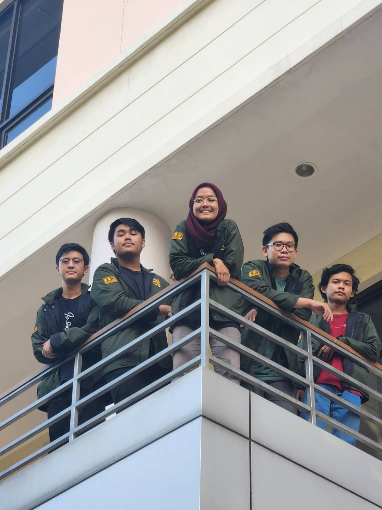

# GamblingSANS
Tugas Besar 1 IF2210 Pemrograman Berorientasi Objek

## Table of Contents
1. [General Information](#general-information)
2. [Features](#features)
3. [Technologies Used](#technologies-used)
4. [Usage](#usage)
5. [Project Status](#project-status)
6. [Acknowledgements](#acknowledgements)
7. [Author](#author)
8. [Group Photo](#groups-photo)

## General Information
Program ini merupakan program permainan Kartu Permen dengan menerapkan konsep Object-Oriented Programming. Penerapan konsep tersebut antara lain penggunaan Inheritance, Polymorphism, Method Overloading, Operator Overloading, Template dan Generic Classes, Exception, C++ Standard Template Library, serta Abstract Base Class.
Mekanisme yang digunakan adalah Deck Kartu Kerajaan Permen yang didalamnya berisi Kartu angka serta Ability Card, Player Card dan Table Card, Putaran Permainan, Poin Hadiah, Perintah Double dan Half, Perintah Next, Ability, serta Combination.

## Features
Fitur (Command) yang digunakan pada program ini adalah:
- NEXT -> Skip giliran pemain dan lanjut ke pemain selanjutnya
- DOUBLE -> Melakukan operasi double pada Poin
- HALF -> Melakukan operasi half pada Poin
- QUADRUPLE -> Menggunakan ability card QUADRUPLE
- QUARTER -> Menggunakan ability card QUARTER
- REROLL -> Menggunakan ability card REROLL
- REVERSE -> Menggunakan ability card REVERSE
- SWITCH -> Menggunakan ability card SWITCH
- SWAP -> Menggunakan ability card SWAP
- HELP -> Menampilkan COMMAND yang dapat digunakan

## Technologies Used
- C++ versi 11.3

## Usage
Untuk menjalankan program:
- Ketik `make uff` pada terminal

## Project Status
Project ini selesai

## Acknowledgements
- Program ini dibuat untuk memenuhi Tugas Besar 1 IF2210 Pemrograman Berorientasi Objek
- Terima kasih kepada Dosen serta Asisten yang telah mengampu Mata Kuliah IF2210 Pemrograman Berorientasi Objek

## Author
- 13521003 Bintang Hijriawan Jachja
- 13521004 Henry Anand Septian Radityo
- 13521006 Azmi Hasna Zahrani
- 13521007 Matthew Mahendra
- 13521024 Ahmad Nadil

## Group's Photo

